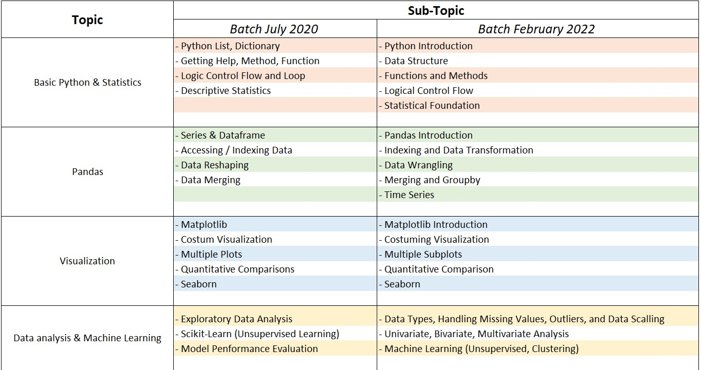

# Python-Data_Science-Basic

This repository contains all of the python notebooks that make in order to complete my daily assignment when i joined the Data Science (Basic) Bootcamp that was held by Sanbercode.
The repository are split into 2 folder. The first is Batch_July_2020 and it contains the assignment that i completed when attend the bootcamp. However, i revisited it again in 2022 and noticed there are a slightly change in the learning material. Thus, i decide to re-do the course and then make a repository for it. The detailed comparison can be shown as this table below.

Feel free to use this repo for learning the basics of data science Also, Please kindly give a star if you find it useful :).

Happy Coding !
Cheers.
